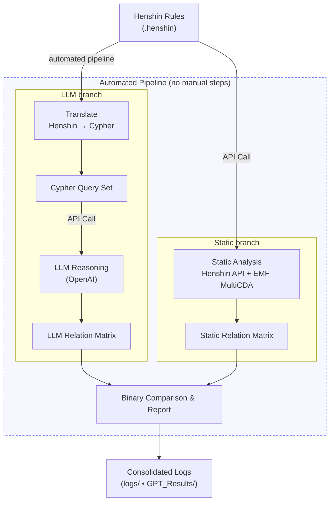

# Henshin Application

This repository provides the codebase of my bachelor’s thesis **Analysis of Conflicts and Dependencies between User Stories in the Age of ChatGPT** in model-driven engineering, conducted in the **[Software Engineering](https://www.uni-marburg.de/en/fb12/research-groups/swt)** research group. The project ties together workflows around [Henshin](https://projects.eclipse.org/projects/modeling.emft.henshin)—an in-place transformation language for the [Eclipse Modeling Framework (EMF)](https://eclipse.dev/emf/)—to (i) translate rule-based graph transformations into [Cypher](https://neo4j.com/docs/getting-started/cypher/) queries, (ii) detect conflicts and dependencies between transformation rules with EMF (MultiCDA), and (iii) explore LLM reasoning over the generated queries via the [OpenAI API](https://platform.openai.com/docs/overview). The pipeline runs end to end without manual steps and logs its results. The aim is to keep the setup reproducible and automated, and to compare the tool-based results with the LLM’s answers side by side.



## Thesis-Driven Objectives

This thesis asks how far model-transformation analysis can be pushed with today’s tooling. The codebase is organised around four parts:

1. **Rule Translation & Validation** — Translate Henshin rules into Cypher queries, check the translation for structural correctness, and prepare artefacts for database tests and LLM prompts.
2. **Static Analysis of Interactions** — Use the Henshin API together with EMF MultiCDA to compute conflicts and dependencies directly on the Henshin models and produce “ground truth” relation matrices.
3. **LLM Reasoning** — Run the generated Cypher through a ChatGPT-based evaluation via the OpenAI API to infer conflicts and dependencies from the query view.
4. **Binary Matrix Comparison** — Normalise both result sets into binary matrices and compare them to measure how closely the LLM reasoning matches the static EMF/Henshin analysis.

All steps are logged, and the produced artefacts are kept so that runs can be repeated, inspected, and discussed in a thesis setting.


## Project Layout

- **HenshinApplication/src** – Java sources that implement the thesis prototypes and evaluation tools.
- **HenshinApplication/src/Henshin** – Core logic for rule translation, conflict detection, dependency detection, result post-processing, and orchestration utilities that extend Eclipse Henshin.
- **HenshinApplication/src/API_ChatGPT** – Helper classes for controlled ChatGPT communication, prompt construction, result caching, and rate-limit handling. Conversation logs are written to `src/API_ChatGPT/GPT_Results/`.
- **HenshinApplication/logs** – Structured experiment output, with execution-time metrics under `logs/time/`, analysis artefacts under `logs/results/`, and detailed run diagnostics for reproducibility.
- **bank/** – A curated corpus of Eclipse Henshin example models (banking domain) used to benchmark the analyses.
- Provided JARs (`org.eclipse.emf.*.jar`) – The exact dependency set used in the thesis, captured to freeze the execution environment.

## Prerequisites

- **JDK 8 or higher** – required to compile and run the Java sources.
- **Python 3** – needed only when using the ChatGPT integration.
  - Install the `openai` package: `pip install openai`.

## Building

Compile the sources from the repository root:

```bash
javac -d HenshinApplication/bin \
  -cp "org.eclipse.emf.common-2.27.0.jar:org.eclipse.emf.ecore-2.29.0.jar:org.eclipse.emf.ecore.xmi-2.17.0.jar:org.eclipse.emf.henshin.model_1.8.0.202302121604.jar:org.eclipse.emf.henshin.interpreter_1.8.0.202302121604.jar:org.eclipse.emf.henshin.multicda.cda_1.8.0.202206300647.jar" \
  HenshinApplication/src/Henshin/*.java HenshinApplication/src/API_ChatGPT/*.java
```

## Running

The main classes can be executed using the compiled binaries and jars on the classpath. The Henshin examples in the `bank/` folder are used automatically.

Run the Cypher generation and ChatGPT interaction:

```bash
java -cp "HenshinApplication/bin:org.eclipse.emf.common-2.27.0.jar:org.eclipse.emf.ecore-2.29.0.jar:org.eclipse.emf.ecore.xmi-2.17.0.jar:org.eclipse.emf.henshin.model_1.8.0.202302121604.jar:org.eclipse.emf.henshin.interpreter_1.8.0.202302121604.jar:org.eclipse.emf.henshin.multicda.cda_1.8.0.202206300647.jar" Henshin.MainClass
```

Run conflict detection:

```bash
java -cp "HenshinApplication/bin:org.eclipse.emf.common-2.27.0.jar:org.eclipse.emf.ecore-2.29.0.jar:org.eclipse.emf.ecore.xmi-2.17.0.jar:org.eclipse.emf.henshin.model_1.8.0.202302121604.jar:org.eclipse.emf.henshin.interpreter_1.8.0.202302121604.jar:org.eclipse.emf.henshin.multicda.cda_1.8.0.202206300647.jar" Henshin.HenshinConflictDetection
```

Run dependency detection:

```bash
java -cp "HenshinApplication/bin:org.eclipse.emf.common-2.27.0.jar:org.eclipse.emf.ecore-2.29.0.jar:org.eclipse.emf.ecore.xmi-2.17.0.jar:org.eclipse.emf.henshin.model_1.8.0.202302121604.jar:org.eclipse.emf.henshin.interpreter_1.8.0.202302121604.jar:org.eclipse.emf.henshin.multicda.cda_1.8.0.202206300647.jar" Henshin.HenshinDependencyDetection
```

Each run creates log files under `HenshinApplication/logs/` with a timestamped filename. Results produced by ChatGPT are stored in `src/API_ChatGPT/GPT_Results/`.
